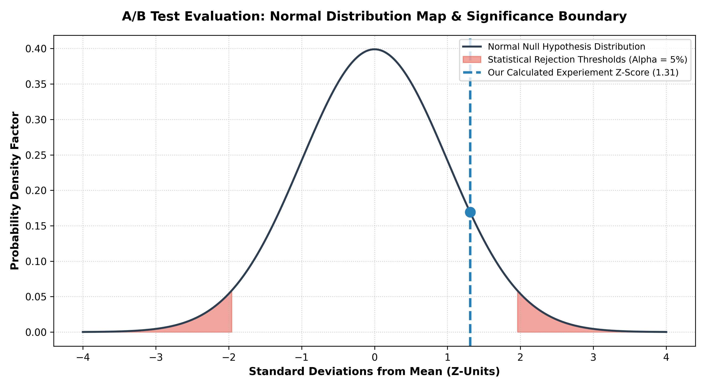

# 📈 Digital Product Optimization: E-Commerce UI A/B Testing Engine

## 📌 Project Portfolio Overview
This repository hosts an enterprise-grade statistical inference engine designed to evaluate digital product experimentation data. Utilizing an extensive dataset of 294,478 unique user session logs from an e-commerce platform, this project transitions away from clean synthetic variables to build a robust data pipeline that handles telemetry mismatches and repeat user bias.

The system executes a formal **Two-Proportion Z-Test** to mathematically evaluate whether a modern checkout user interface layout (Variant B / Treatment) drives a statistically significant increase in customer conversion rates over the traditional layout (Variant A / Control).

---

## 📈 Executive Summary & Core Insights
The statistical framework successfully processed 290,583 unique, independent customer interactions following strict data sanitization protocols.

### 🌟 Experimental Findings & Hypotheses Diagnostics
* **Control Group Conversion Baseline:** **12.04%** (145,274 users)
* **Treatment Group Conversion Baseline:** **11.88%** (145,309 users)
* **Calculated Statistical $p$-Value:** **0.1899**
* **The Decision:** **No Statistically Significant Difference Detected.** Because our calculated $p$-value (0.1899) sits far above the standard significance threshold ($\alpha = 0.05$), we fail to reject the null hypothesis ($H_0$). The minor performance discrepancy between the two layouts is a random statistical fluctuation.

---

## 📊 Visualizing the Significance Boundary
The visualization below maps out the standard normal distribution curve of our null hypothesis. The highlighted red zones show the critical rejection thresholds ($\pm 1.96$ standard deviations), while the blue marker identifies our calculated experiment Z-score, demonstrating visually why our test fell short of significance.

---

## 🛠️ Production Data Engineering Pipeline
Running valid corporate experiments requires eliminating data corruption. The analytical pipeline executes the following stages:
1. **Log Ingestion:** Pulling high-volume conversion matrices into structured Pandas environments using high-availability data streams.
2. **Telemetry Sanitization:** Identifying and dropping anomalous cross-over rows where group tracking flags did not correspond with the landing page actually served to the user.
3. **User Independence Filter:** Removing duplicate records for users who entered the system multiple times to protect the core statistical assumption of independent observations.
4. **Proportional Inference Optimization:** Feeding aggregated clean conversion vectors into a two-sided proportional model to extract true $Z$-stats and $p$-values.

---

## 💡 Prescriptive Business Strategies
* **Experiment Rollback:** Halt the production deployment of the new checkout page layout. The model proves it adds zero financial value to the current baseline and risks lowering overall conversions.
* **Iterative Friction Audit:** Conduct qualitative user-experience sessions to discover why the new layout failed to drive traction, focusing on potential friction points in the text forms or call-to-action responsiveness.

---

## 💻 Tech Stack & Engineering Dependencies
* **Core Language:** Python 3.12+
* **Statistical Modeling Core:** `statsmodels`, `scipy.stats`
* **Data Processing:** `pandas`, `numpy`
* **Visual Vectors:** `matplotlib`, `seaborn`
